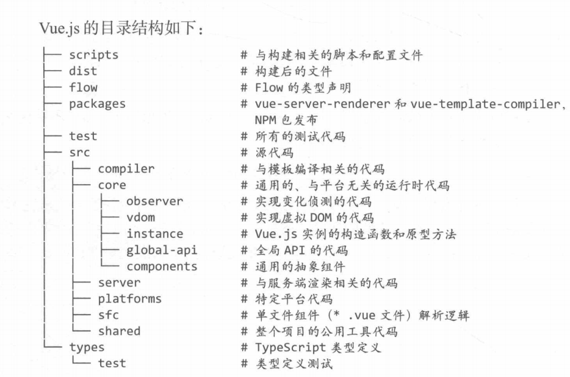
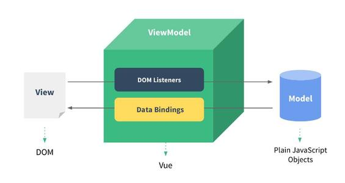

## VUE原理
### ——响应式原理

---

## vue源码的目录结构
<!--  -->

```
├── scripts         # 构建相关的文件，一般情况下我们不需要动
│ ├── git-hooks     # git钩子
│ ├── alias.js      # 别名配置
│ ├── config.js     # rollup配置的文件
│ ├── build.js      # 构建 config.js 中所有的rollup配置
│ ├── ci.sh         # 持续集成运行的脚本
│ ├── release.sh    # 自动发布新版本的脚本
├── dist            # 构建后文件的输出目录
├── examples        # Vue开发的应用案例
├── flow            # 类型声明，使用开源项目 Flow
├── packages        # 独立发布的包的目录
├── test            # 所有测试文件
├── src             # 源码
│ ├── compiler      # 编译器代码的存放目录，将 template 编译为 render 函数
│ ├── core          # 存放通用的，与平台无关的运行时代码
│ │ ├── observer    # 响应系统，包含数据观测的核心代码
│ │ ├── vdom        # 虚拟DOM创建(creation)和打补丁(patching)的代码
│ │ ├── instance    # Vue构造函数设计相关的代码
│ │ ├── global-api  # 给Vue构造函数挂载全局方法(静态方法)或属性的代码
│ │ ├── components  # 抽象出来的通用组件
│ ├── server        # 服务端渲染(server-side rendering)的相关代码
│ ├── platforms     # 平台特有的相关代码，不同平台的不同构建的入口文件也在这里
│ │ ├── web         # web平台
│ │ │ ├── entry-runtime.js                # 运行时构建的入口，不包含模板(template)到render函数的编译器，所以不支持 template 选项，我们使用vue默认导出的就是这个运行时的版本。
│ │ │ ├── entry-runtime-with-compiler.js  # 独立构建版本的入口，它在 entry-runtime 的基础上添加了模板(template)到render函数的编译器
│ │ │ ├── entry-compiler.js               # vue-template-compiler 包的入口文件
│ │ │ ├── entry-server-renderer.js        # vue-server-renderer 包的入口文件
│ │ │ ├── entry-server-basic-renderer.js  # 输出 packages/vue-server-renderer/basic.js 文件
│ │ ├── weex       # 混合应用
│ ├── sfc          # 单文件组件(.vue文件)的解析逻辑，用于vue-template-compiler包
│ ├── shared       # 整个代码库通用的代码
├── package.json   # 不解释
├── yarn.lock      # yarn 锁定文件
├── .editorconfig  # 针对编辑器的编码风格配置文件
├── .flowconfig    # flow 的配置文件
├── .babelrc       # babel 配置文件
├── .eslintrc      # eslint 配置文件
├── .eslintignore  # eslint 忽略配置
├── .gitignore     # git 忽略配置
```

--

## 源码从哪开始看？

在 web 应用下，我们分析 Runtime + Compiler 构建出来的 Vue.js，它的入口是 `src/platforms/webentry-runtime-with-compiler.js`，由此文件一步步看引用vue的路径，最终会来到vue的定义`src/core/instance/index.js`:

--

vue的定义-`src/core/instance/index.js`:

```javascript
import { initMixin } from './init'
import { stateMixin } from './state'
import { renderMixin } from './render'
import { eventsMixin } from './events'
import { lifecycleMixin } from './lifecycle'
import { warn } from '../util/index'

function Vue (options) {
  if (process.env.NODE_ENV !== 'production' &&
    !(this instanceof Vue)
  ) {
    warn('Vue is a constructor and should be called with the `new` keyword')
  }
  this._init(options)
}

initMixin(Vue)
stateMixin(Vue)
eventsMixin(Vue)
lifecycleMixin(Vue)
renderMixin(Vue)

export default Vue
```

---

## 什么是MVVM？

--

MVVM最早由微软提出来，它借鉴了桌面应用程序的MVC思想，在前端页面中，把Model用纯JavaScript对象表示，View负责显示（html页面），两者做到了最大限度的分离。

把Model和View关联起来的就是ViewModel。

--

vue中的MVVM




---

<!-- .slide: style="text-align: left;" -->
## vue中的MVVM如何实现
1. 数据劫持
2. 订阅发布

--

### 1. 数据劫持

* vue2中用了ES5的**Object.defineProperty**方法
* vue3用了ES6的**Proxy**

--

### 2. 订阅发布

发布—订阅模式又叫观察者模式，它定义对象间的一种一对多的依赖关系，当一个对象的状态发生改变时，所有依赖于它的对象都将得到通知。

--

#### vue的实现

1. Observer。这里的主要工作是递归地监听对象上的所有属性，在属性值改变的时候，触发相应的watcher。
2. Watcher。观察者，当监听的数据值修改时，执行响应的回调函数（Vue里面的更新模板内容）。
3. Dep。连接Observer和Watcher的桥梁，每一个Observer对应一个Dep，它内部维护一个数组，保存与该Observer相关的Watcher。

--

### 数据绑定demo

easyVue

--

源码：

```javascript
// 源码位置：src/core/observer/index.js

/**
 * Observer类会通过递归的方式把一个对象的所有属性都转化成可观测对象
 */
export class Observer {
  constructor (value) {
    this.value = value
    // 给value新增一个__ob__属性，值为该value的Observer实例
    // 相当于为value打上标记，表示它已经被转化成响应式了，避免重复操作
    def(value,'__ob__',this)
    if (Array.isArray(value)) {
      // 当value为数组时的逻辑
      // ...
    } else {
      this.walk(value)
    }
  }

  walk (obj: Object) {
    const keys = Object.keys(obj)
    for (let i = 0; i < keys.length; i++) {
      defineReactive(obj, keys[i])
    }
  }
}
/**
 * 使一个对象转化成可观测对象
 * @param { Object } obj 对象
 * @param { String } key 对象的key
 * @param { Any } val 对象的某个key的值
 */
function defineReactive (obj,key,val) {
  // 如果只传了obj和key，那么val = obj[key]
  if (arguments.length === 2) {
    val = obj[key]
  }
  if(typeof val === 'object'){
      new Observer(val)
  }
  Object.defineProperty(obj, key, {
    enumerable: true,
    configurable: true,
    get(){
      console.log(`${key}属性被读取了`);
      return val;
    },
    set(newVal){
      if(val === newVal){
          return
      }
      console.log(`${key}属性被修改了`);
      val = newVal;
    }
  })
}
```


---

### 数组的变化侦测


---

<!-- .slide: style="text-align: left;" -->
# THE END
